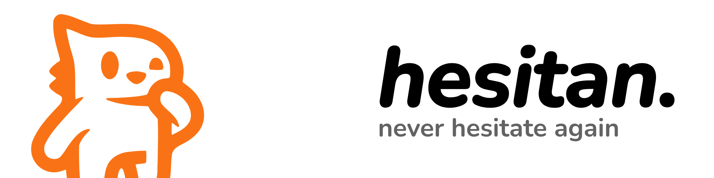

<picture>
	<source media="(prefers-color-scheme: dark)" srcset="assets/banner_dark.png">
	
</picture>

## Introduction
Hesitan is a simple productivity app built to empower your daily workflow with built-in AI integration for assist.

## Features
### Task List Management & Focus Mode
A simple task list system without any other complicated stuff! Start a task and go into focus mode where the app will alert user when detected distracting app being opened.

You are unable to mark a task as done without actually finishing the timer on focus mode!

### AI Assistant Built-In
Integrated with various provider, use the AI to create a clear learning roadmap, or ask question for solution with it! Ability to act as tutor and assistant on roadmap creation.

### Opt-In Functionality
Monitoring & AI functionality is purely optional, user could switch the function off or choose to not use it!

## Building
You will require Node.js v22 & npm for this.
Run the below command to download all the dependency
```
npm i
```
Build with either of the command
```
npm run build:[your-os]
npm run build
```

## API Keys
To use the chatbot, you will need to get an API key from the providers. To note that some free API key may collect your data, so use it at your own risk.

Ollama will be supported in future.

## Credits
[RemixIcon](https://github.com/Remix-Design/RemixIcon) for several icons in the project.

## License
[Apache License 2.0](LICENSE)